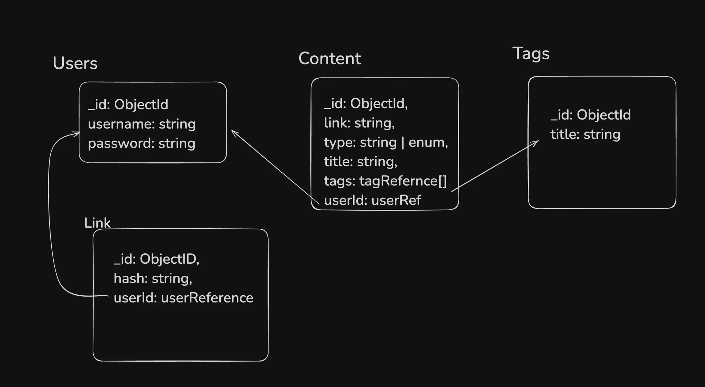

# Brainly Backend API

A robust Node.js backend API for the Brainly social content aggregation platform. Built with Express.js, TypeScript, and MongoDB.

## 🔗 Links

- **Live Website**: [Live Website](https://brainly-fe-v2.vercel.app/)
- **Frontend Repository**: [Brainly Frontend](https://github.com/Priyanshu1-0/brainly-fe-v2)


## 🗄️ Database Schema


*Database schema showing relationships between Users, Content, Tags, and Link entities*

### Entity Relationships

- **Users** can create multiple **Content** items and **Links**
- **Content** can have multiple **Tags** for categorization
- **Content** is associated with a specific **User**
- **Links** are associated with specific **Users**

## 🚀 Features

- **User Authentication**: JWT-based authentication with bcrypt password hashing
- **Content Management**: CRUD operations for content aggregation
- **Tag System**: Categorize content with tags
- **Link Sharing**: Generate and manage shareable links
- **RESTful API**: Clean, RESTful endpoints
- **Type Safety**: Full TypeScript implementation
- **Data Validation**: Zod schema validation
- **CORS Support**: Cross-origin resource sharing enabled

## 🛠️ Tech Stack

- **Runtime**: Node.js with TypeScript
- **Framework**: Express.js
- **Database**: MongoDB with Mongoose ODM
- **Authentication**: JWT (JSON Web Tokens)
- **Password Hashing**: bcrypt
- **Validation**: Zod
- **Environment**: dotenv for configuration

## 📁 Project Structure

```
src/
├── index.ts          # Main server file with Express setup
├── db.ts            # MongoDB connection configuration
├── middleware.ts    # Custom middleware (auth, validation)
└── config.ts        # Environment configuration
```

## 🚀 Getting Started

### Prerequisites

- Node.js (v16 or higher)
- MongoDB (local or cloud instance)
- npm or yarn

### Installation

1. Clone the repository:
```bash
git clone https://github.com/Priyanshu1-0/brainly
cd brainly
```

2. Install dependencies:
```bash
npm install
```

3. Set up environment variables:
```bash
cp .env.example .env
```

4. Configure your `.env` file:
```env
MONGODB_URI=your_mongodb_connection_string
JWT_SECRET=your_jwt_secret_key
PORT=3000
```

5. Start the development server:
```bash
npm run dev
```

The API will be available at `http://localhost:3000`

## 📚 API Endpoints

### Authentication
- `POST /api/auth/signup` - User registration
- `POST /api/auth/signin` - User login

### Content Management
- `GET /api/content` - Get all content
- `POST /api/content` - Create new content
- `GET /api/content/:id` - Get specific content
- `PUT /api/content/:id` - Update content
- `DELETE /api/content/:id` - Delete content

### Tags
- `GET /api/tags` - Get all tags
- `POST /api/tags` - Create new tag

### Links
- `GET /api/links` - Get all links
- `POST /api/links` - Create new link
- `GET /api/links/:hash` - Get link by hash

## 🔐 Authentication

The API uses JWT (JSON Web Tokens) for authentication:

1. **Sign Up**: Create a new user account
2. **Sign In**: Authenticate and receive JWT token
3. **Protected Routes**: Include JWT token in Authorization header

### Example Usage

```bash
# Sign up
curl -X POST http://localhost:3000/api/auth/signup \
  -H "Content-Type: application/json" \
  -d '{"username": "user@example.com", "password": "password123"}'

# Sign in
curl -X POST http://localhost:3000/api/auth/signin \
  -H "Content-Type: application/json" \
  -d '{"username": "user@example.com", "password": "password123"}'

# Use protected endpoint
curl -X GET http://localhost:3000/api/content \
  -H "Authorization: Bearer YOUR_JWT_TOKEN"
```

## 🗄️ Database Models

### User Model
```typescript
{
  _id: ObjectId,
  username: string,
  password: string (hashed)
}
```

### Content Model
```typescript
{
  _id: ObjectId,
  link: string,
  type: string | enum,
  title: string,
  tags: tagReference[],
  userId: userReference
}
```

### Tag Model
```typescript
{
  _id: ObjectId,
  title: string
}
```

### Link Model
```typescript
{
  _id: ObjectId,
  hash: string,
  userId: userReference
}
```

## 🔧 Development

### Available Scripts

- `npm run dev` - Start development server with hot reload
- `npm run build` - Build TypeScript to JavaScript
- `npm run start` - Start production server
- `npm test` - Run tests (to be implemented)

### Environment Variables

| Variable | Description | Required |
|----------|-------------|----------|
| `MONGODB_URI` | MongoDB connection string | Yes |
| `JWT_SECRET` | Secret key for JWT signing | Yes |
| `PORT` | Server port (default: 3000) | No |

## 🧪 Testing

Testing framework setup is ready for implementation. You can add:
- Unit tests with Jest
- Integration tests with Supertest
- API endpoint testing

## 📦 Deployment

### Production Build

1. Build the project:
```bash
npm run build
```

2. Start the production server:
```bash
npm run start
```

### Environment Setup

Make sure to set proper environment variables in production:
- Use a strong JWT secret
- Configure MongoDB Atlas or production database
- Set up proper CORS origins

## 🔒 Security Features

- **Password Hashing**: bcrypt for secure password storage
- **JWT Authentication**: Stateless authentication
- **Input Validation**: Zod schema validation
- **CORS Protection**: Configurable cross-origin policies
- **Environment Variables**: Secure configuration management

## 🤝 Contributing

1. Fork the repository
2. Create a feature branch (`git checkout -b feature/amazing-feature`)
3. Commit your changes (`git commit -m 'Add amazing feature'`)
4. Push to the branch (`git push origin feature/amazing-feature`)
5. Open a Pull Request


**Note**: Make sure to add the database schema diagram image to `docs/images/database-schema.png` for the README to display it properly. 